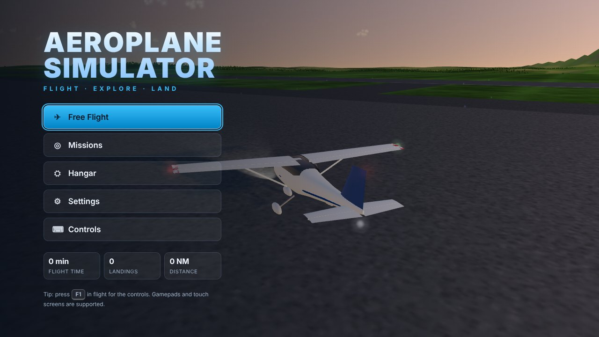
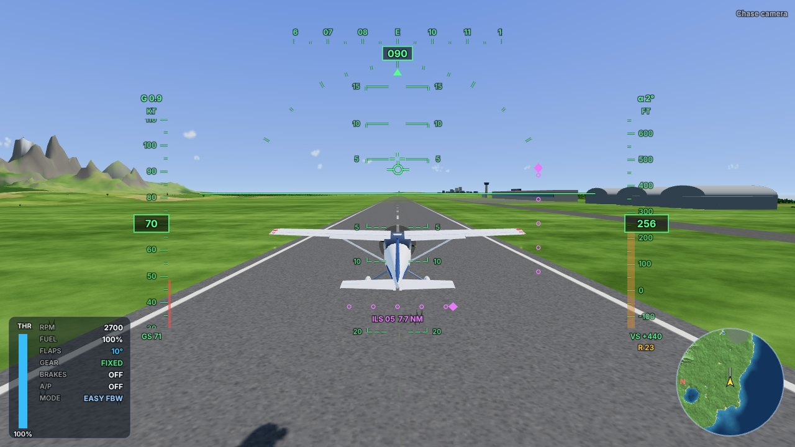
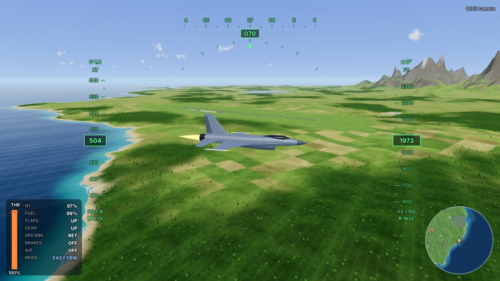
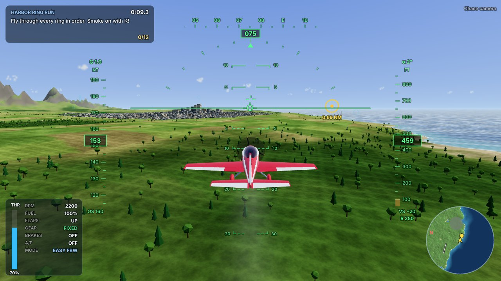
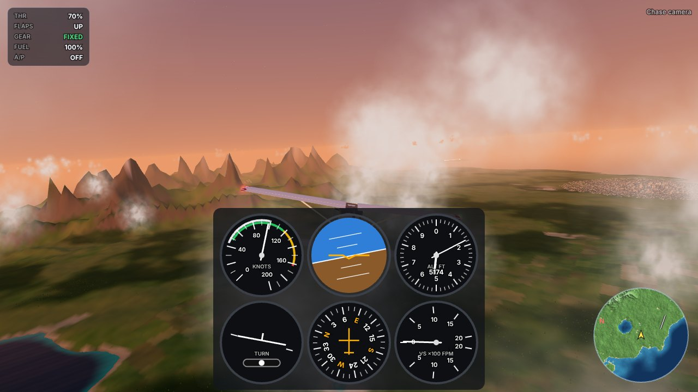
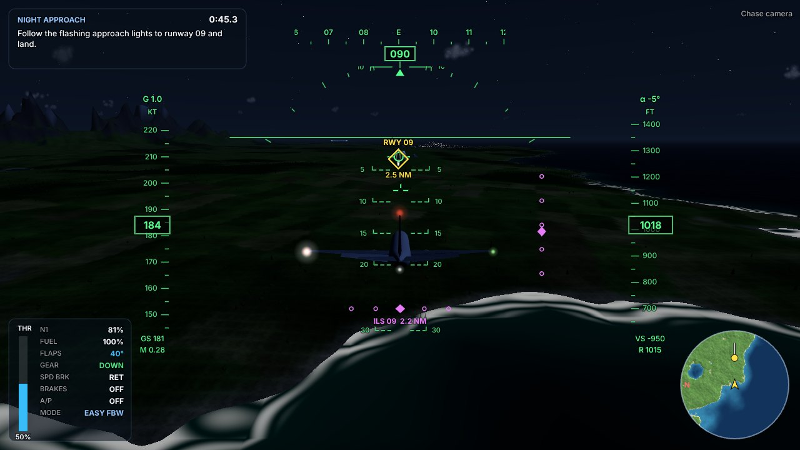
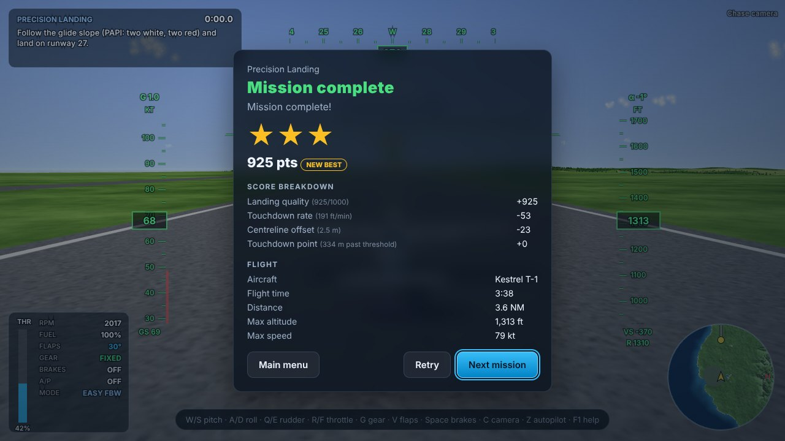

# ✈ Aeroplane Simulator

A complete 3D flight simulator game that runs in the browser. You fly four very different aircraft over a procedurally generated island with airports, a city, forests, mountains and the open sea. It has a real six-degree-of-freedom flight model, missions with scoring, and day and night cycles with weather.

Everything is generated in code: geometry, textures, terrain and sound. The game ships no image, model or audio assets.



| | |
|---|---|
|  |  |
|  |  |
|  |  |

## Quick start

```bash
npm install
npm run dev          # http://localhost:5173
```

You need Node 20 or newer and a browser with WebGL 2 (current Chrome, Edge, Firefox or Safari 15+).

| Command | What it does |
|---|---|
| `npm run dev` | Development server with hot reload |
| `npm run build` | Typecheck and production build into `dist/` (fully static, works from any sub-path) |
| `npm run preview` | Serve the production build on port 4173 |
| `npm test` | Unit tests (Vitest): physics, world and missions |
| `npm run test:e2e` | End-to-end tests (Playwright) against the production build |
| `npm run typecheck` | TypeScript only |
| `npm run build:artifact` | Build into `dist-artifact/` with three.js left external (load it from a CDN with an import map) |

To host the game, copy `dist/` to any static web server. The repository also includes a manual **Deploy to GitHub Pages** workflow under `.github/workflows/deploy-pages.yml`. Enable Pages with the source set to *GitHub Actions*, then run the workflow from the Actions tab.

## Features

### Flight model
- **Rigid-body physics:** 6-DOF simulation at a fixed 240 Hz. Aerodynamics use stability derivatives (Cessna-, Extra-, F-16- and A320-class data) on the ISA standard atmosphere.
- **Aerodynamic effects:** a smooth stall with a nose-down pitch break and wing-drop tendency, ground effect, induced drag, transonic drag rise and Mach effects.
- **Engines:** piston engines (power to thrust through a propeller) and jets with afterburner and spool lag, plus fuel burn, windmilling and engine failure.
- **Aircraft systems:** flap detents, retractable gear with a weight-on-wheels interlock, speedbrakes and auto-deploying ground spoilers, wheel brakes and a parking brake, and elevator trim.
- **Ground handling:** spring-damper landing gear with a slip-angle tyre model and speed-scheduled nose-wheel steering, on runway, grass and sand surfaces.
- **Damage and crashes:** gear collapse on a hard landing, wing, prop, tail and engine strikes, belly landings, ditching, collisions with buildings and trees, and structural failure from over-G or overspeed.
- **Two flight models:**
  - **Easy** is fly-by-wire. The stick commands roll and pitch rates. Letting go holds your flight path and bank, and small banks level out. It includes stall (AoA) and G protection and automatic turn coordination. The inner loops invert the aerodynamic model, so the aircraft responds the same at every speed.
  - **Realistic** gives direct control-surface authority with manual trim.
- **Autopilot:** heading, altitude and speed hold with autothrottle. Moving the stick or throttle disconnects it.
- **Weather in the physics:** wind, gusts, wind shear, and turbulence inside clouds and near the ground.

### Aircraft
| Aircraft | Type | Highlights |
|---|---|---|
| **Kestrel T-1** | High-wing trainer | Forgiving, fixed gear, 4 flap settings |
| **Vortex A-300** | Aerobatic monoplane | Rolls at about 300°/s, symmetric wing, smoke system |
| **Falcon JX-16** | Supersonic fighter | Afterburner, Mach 1+, retractable gear, speedbrake |
| **SkyLiner 320** | Twin-jet airliner | Heavy and stable, 5 flap settings, ground spoilers |

Each model is built from lofted fuselages and NACA-airfoil wings. Ailerons, elevators and stabilators, rudder, flaps and spoilers are all hinged and animated. The props spin with motion blur, and the gear retracts, compresses and steers. Each aircraft has nav, strobe and beacon lights and a landing light, and the jet has an afterburner flame.

### World
- **The island:** a procedural archipelago about 33 km across, with a mountain range up to roughly 2,000 m, a lake, farmland patchwork, forests, beaches and an offshore islet.
- **Terrain streaming:** chunks have five levels of detail and are generated in **Web Workers**. The physics samples the exact rendered triangles.
- **Airports:** four of them, Harbor International, North Field, Eagle Peak Strip and Gull Island. Each has:
  - runway markings, taxiways, aprons and buildings
  - runway, threshold and taxiway lights
  - approach lights with a sequenced flasher
  - working **PAPI** glide-path lights
  - a windsock
- **Port Harbor:** a city of instanced buildings whose procedural windows light up at night.
- **Sky and water:** the sky shader shows the sun, moon and stars. The ocean has wave normals, Fresnel reflections, depth-tinted shallows and shore foam. Billboard cumulus clouds drift with the wind, and flying through them whites out the view.
- **Time and weather:** dawn, day, sunset and night, combined with clear, cloudy, overcast and storm (rain and lightning).

### Gameplay
- **Free Flight:** pick any aircraft, eight start positions (runways, in flight, or on final approach), the time of day, the weather and the wind.
- **11 missions with 1–3 star scoring and saved records:**
  - a training circuit
  - ring races: around the city, through a mountain valley, and a supersonic sprint
  - precision, short-field, night and storm landings
  - airliner and island-hopping routes
  - a dead-stick engine failure
- **Landing scoring:** touchdown sink rate (relative to what the gear can take), centreline offset and touchdown-zone accuracy.
- **Career stats:** flight time, landings, distance and records are stored locally.

### Interface
- **HUD:** a conformal fighter-style HUD whose pitch ladder and flight-path marker are aligned to the real horizon. It has speed, altitude and heading tapes, a bank scale, G, Mach, AoA, radar altitude and an **ILS** glideslope and localiser.
- **Gauges mode:** a classic six-pack of instruments (airspeed, attitude, altimeter, turn coordinator, heading, VSI).
- **Warnings:** stall, pull up (terrain look-ahead), overspeed, over-G, gear, bank angle, low fuel and engine off, with an audible stall horn and alerts.
- **Maps:** a rotating minimap and a full-screen navigation chart.
- **Cameras:** chase, cockpit (with an instrument panel), orbit and fly-by. Mouse look and zoom work in every view.
- **Audio:** procedural Web Audio for engines, wind, warnings, gear, touchdown, crashes and UI.
- **Effects:** smoke trails, contrails, wingtip vortices, tyre smoke, dust, explosions, debris and water splashes.
- **Input:** keyboard, **gamepad** and **touch screens** (a virtual stick, throttle lever and buttons appear automatically).

## Controls

| Action | Keyboard | Gamepad |
|---|---|---|
| Pitch / roll | `W` `S` / `A` `D` or arrow keys | Left stick |
| Rudder / nose-wheel steering | `Q` `E` | LB / RB |
| Throttle | `R` `F`, `Shift`, `PgUp` `PgDn`, `0`–`9` | RT / LT |
| Brakes (hold) / parking brake | `Space` / `N` | X |
| Gear | `G` | A |
| Flaps up / down / cycle | `[` `]` / `V` | B (cycle) |
| Speedbrake / spoilers | `X` | L3 |
| Autopilot | `Z` | D-pad ↑ |
| Trim (realistic model) | `,` `.` | — |
| Lights / smoke / engine | `L` / `K` / `I` | D-pad ↓ / → |
| Camera / look back | `C` / hold `B`; drag the mouse to look, wheel to zoom | Y / right stick |
| HUD style / map | `H` / `M` | D-pad ← / Back |
| Pause / help / mute / restart | `Esc` or `P` / `F1` / `U` / `Backspace` | Start |

**First flight:** apply full power (`R`). At about 55 kt, pull back gently (`S`) and climb. To land, slow down, lower the flaps (`V`), follow the PAPI lights (two white, two red), flare just above the runway and brake with `Space`.

## Project structure

```
src/
  main.ts                 bootstrap
  core/math.ts            numeric helpers, units, seeded RNG
  physics/
    FlightModel.ts        6-DOF rigid body, aerodynamics, engines, gear, crash detection
    FlightControls.ts     fly-by-wire (model inversion), realistic mode, autopilot
    atmosphere.ts         ISA atmosphere
  aircraft/
    specs.ts              the four aircraft: mass, derivatives, engines, gear, limits
    geometry.ts           lofted fuselages and airfoil surfaces
    AircraftModel.ts      3D models and animation (surfaces, gear, props, lights)
  world/
    WorldMap.ts           analytic island, airports, obstacles, physics ground queries
    terrainGen.ts         chunk mesh, colour and tree generation (worker-safe)
    terrain.worker.ts     Web Worker entry; WorkerPool.ts manages it with a fallback
    Terrain.ts            LOD chunk streaming and instanced forests
    Sky.ts, Water.ts, Clouds.ts, City.ts, Airports.ts, Environment.ts, World.ts
  game/
    Game.ts               state machine, main loop, sessions, effects and HUD wiring
    CameraController.ts   chase, cockpit, orbit and fly-by cameras
    Missions.ts           mission definitions, runtime and scoring
    Settings.ts           persistent settings, records and career
  ui/                     HUD (canvas), Minimap, Menus (DOM)
  input/                  keyboard, gamepad and touch input
  audio/AudioEngine.ts    procedural Web Audio
  fx/                     particles, debris and rain
tests/                    Vitest: physics, world and missions (headless simulations)
e2e/                      Playwright: menus, flying, missions, crash and persistence
```

## Testing

- **Unit tests** (`npm test`, 62 tests) fly the real flight model headlessly. They cover:
  - every aircraft resting on its gear, taking off, holding altitude and bank, and flying the autopilot
  - stalls near the published stall speeds, with recovery
  - flying a stabilised approach to a soft landing that stops on the centreline
  - crash detection, G protection and aircraft systems
  - world tests: determinism, flat airports, clear approach corridors, and that the terrain mesh matches the physics surface
  - complete missions flown by a scripted pilot
- **End-to-end tests** (`npm run test:e2e`, 7 tests) drive the production build in Chromium using software WebGL. They cover:
  - booting and navigating the menus
  - configuring a flight through the UI, taking off and climbing
  - keyboard controls
  - pausing
  - finishing a mission for three stars
  - the crash report
  - settings persistence

CI (`.github/workflows/ci.yml`) runs the typecheck, the unit tests, the build and the end-to-end suite.

## Tech

[Three.js](https://threejs.org/) r170 · TypeScript · Vite · Vitest · Playwright. Rendering uses ACES tone mapping, a logarithmic depth buffer (for a 0.1 m to 90 km view range), PCF soft shadows that follow the aircraft, and image-based lighting generated from the sky shader.
